# Pigeon AI - Architecture Diagram

## Complete System Architecture

### Frontend Architecture (Mobile Client)

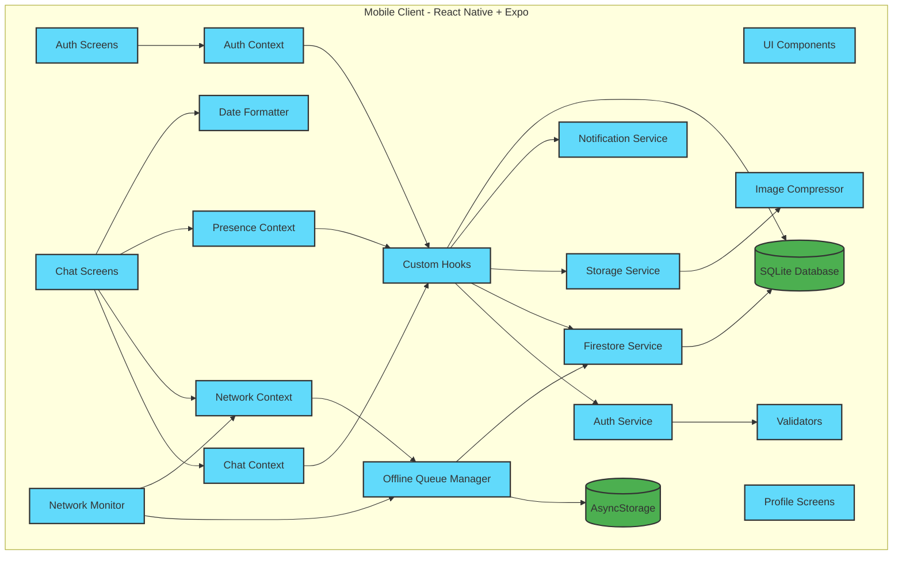

### Backend Architecture (Firebase)

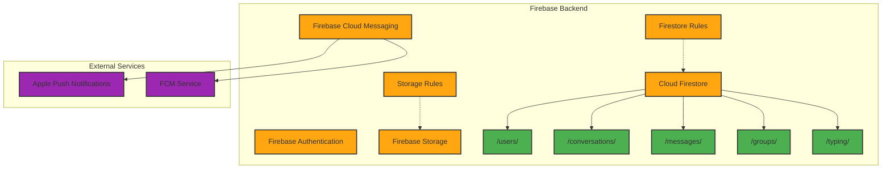

### Complete System Integration

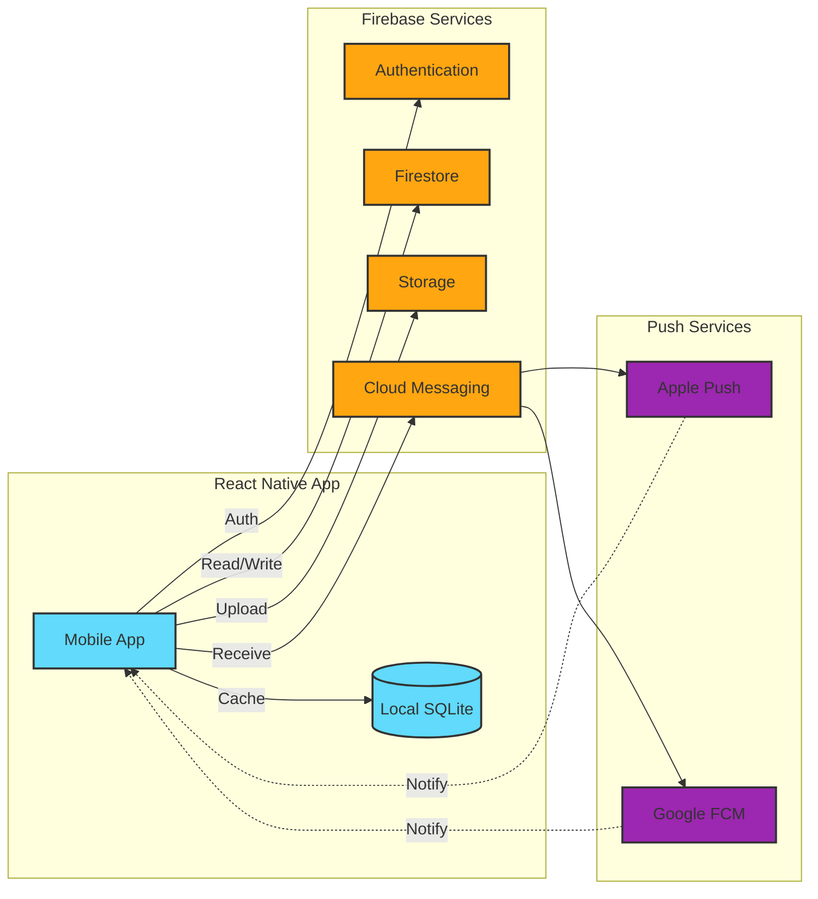

---

## Data Flow Diagrams

### 1. Message Sending Flow (Online)

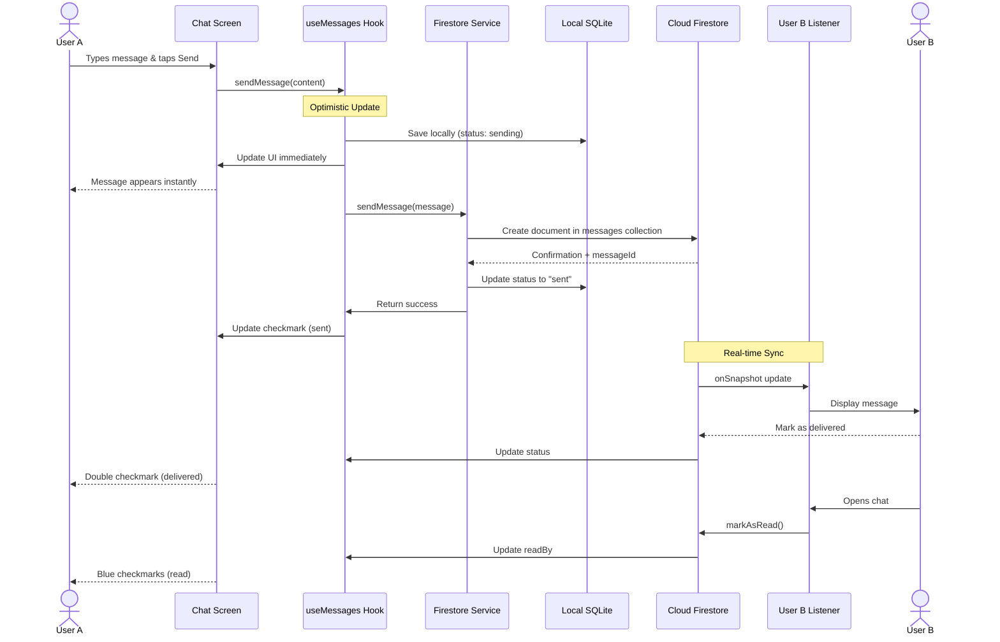

### 2. Message Sending Flow (Offline)

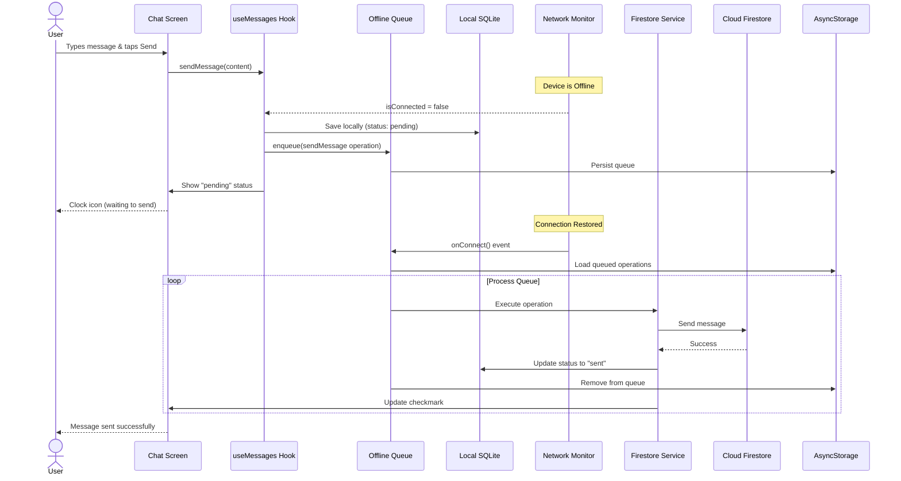

### 3. Real-Time Presence & Typing

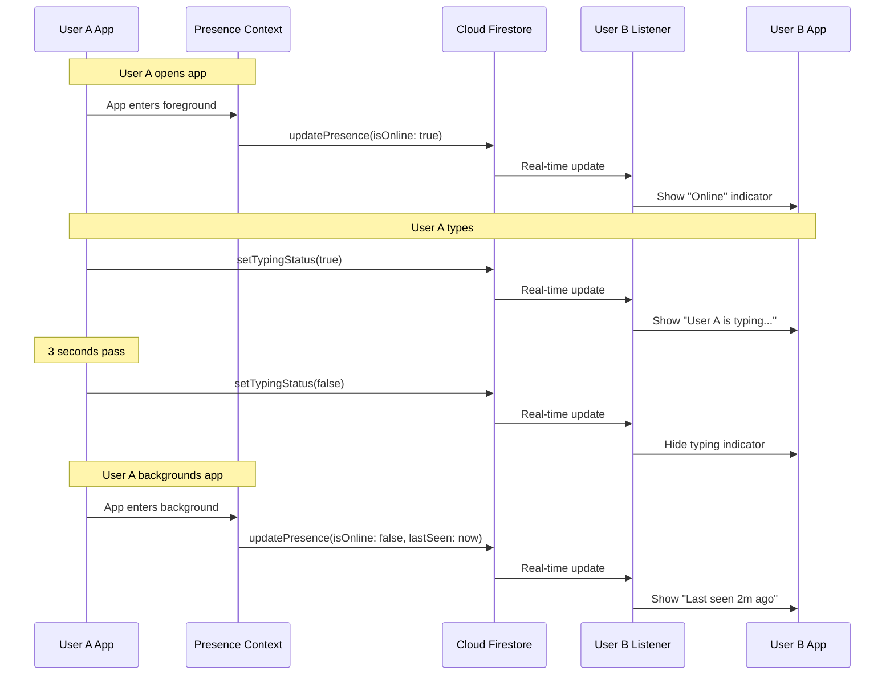

### 4. Image Upload Flow

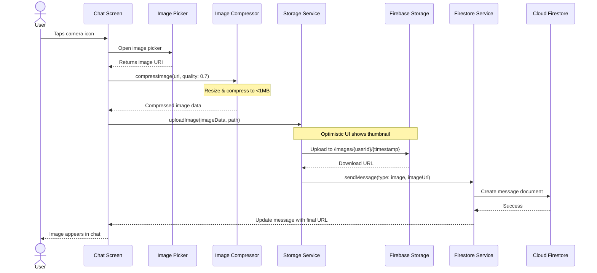

### 5. Push Notification Flow

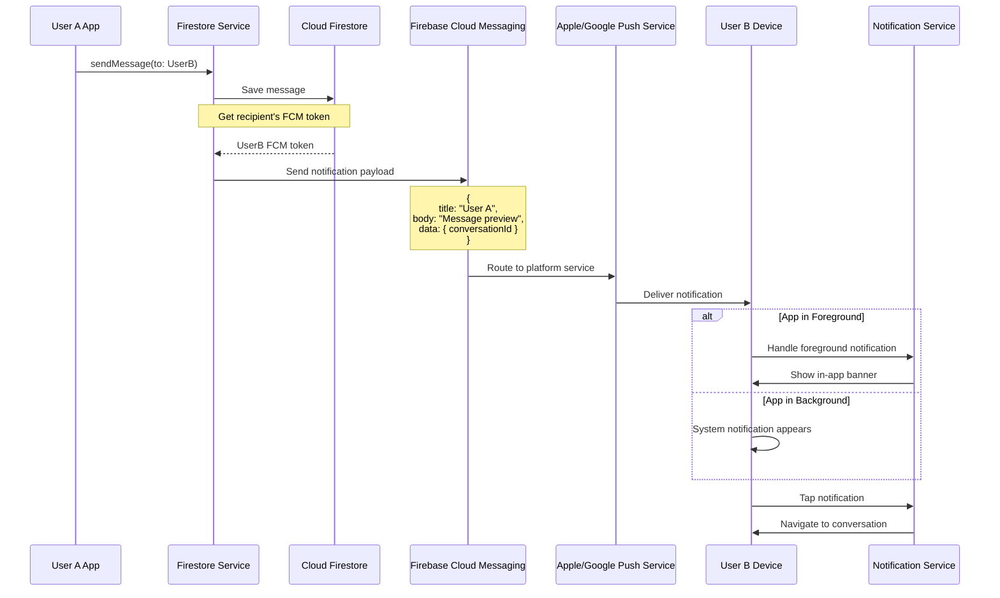

### 6. Group Chat Message Flow

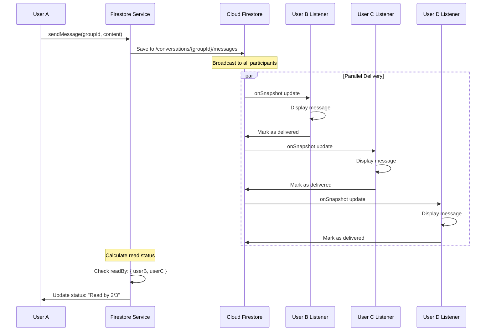

---

## Technology Stack Map

```mermaid
graph LR
    subgraph "Frontend Technologies"
        RN[React Native<br/>Cross-platform Framework]
        Expo[Expo<br/>Development Platform]
        TS[TypeScript<br/>Type Safety]
        RNav[React Navigation<br/>Routing]
    end
    
    subgraph "State Management"
        Context[React Context<br/>Global State]
        Hooks[Custom Hooks<br/>Business Logic]
    end
    
    subgraph "Local Storage"
        SQLiteDB[Expo SQLite<br/>Structured Data]
        AsyncStor[AsyncStorage<br/>Key-Value Store]
    end
    
    subgraph "Firebase Services"
        FBAuth[Firebase Auth<br/>Authentication]
        FBFirestore[Cloud Firestore<br/>Real-time DB]
        FBStorage[Firebase Storage<br/>File Storage]
        FBMessaging[Firebase Cloud Messaging<br/>Push Notifications]
    end
    
    subgraph "Expo APIs"
        ExpoCam[expo-image-picker<br/>Camera & Gallery]
        ExpoNotif[expo-notifications<br/>Local & Push]
        ExpoSQL[expo-sqlite<br/>Database]
        ExpoNet[@react-native-community/netinfo<br/>Network Status]
    end
    
    subgraph "UI Libraries"
        GiftedChat[react-native-gifted-chat<br/>Chat UI Components]
        SafeArea[react-native-safe-area-context<br/>Safe Areas]
    end
    
    subgraph "Testing"
        Jest[Jest<br/>Test Runner]
        RTL[React Testing Library<br/>Component Tests]
    end
    
    RN --> Expo
    RN --> TS
    RN --> RNav
    RN --> Context
    Context --> Hooks
    
    Hooks --> SQLiteDB
    Hooks --> AsyncStor
    Hooks --> FBAuth
    Hooks --> FBFirestore
    Hooks --> FBStorage
    Hooks --> FBMessaging
    
    Expo --> ExpoCam
    Expo --> ExpoNotif
    Expo --> ExpoSQL
    Expo --> ExpoNet
    
    RN --> GiftedChat
    RN --> SafeArea
    
    TS --> Jest
    Jest --> RTL
```

---

## Component Interaction Map

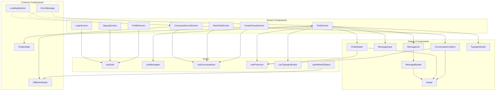

---

## Offline Queue Architecture

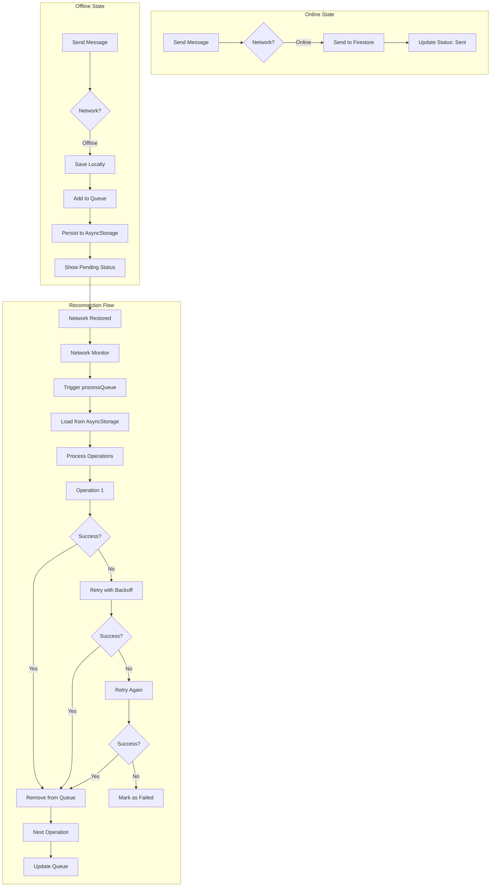

---

## Security & Access Control Flow

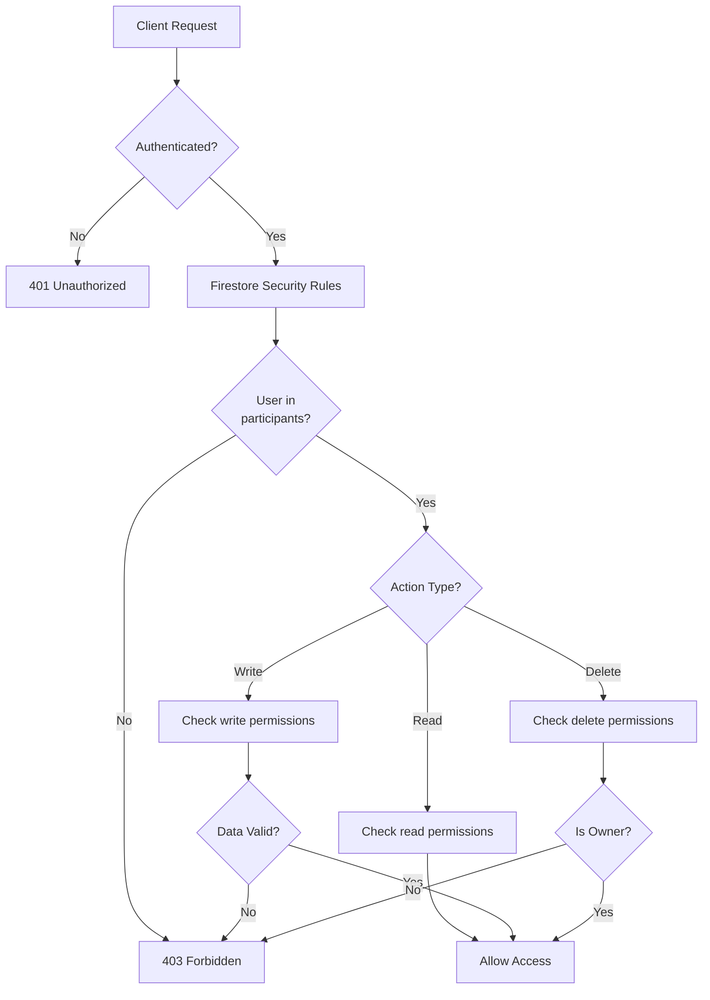

---

## Notes

- **Real-time Updates**: Firestore onSnapshot listeners provide <1 second latency
- **Offline-First**: All data written to local SQLite before Firestore
- **Optimistic UI**: UI updates immediately, then syncs with server
- **Queue Persistence**: AsyncStorage ensures queued operations survive app restarts
- **Security**: All Firebase access controlled by security rules
- **Scalability**: Firebase auto-scales; client handles offline scenarios gracefully


