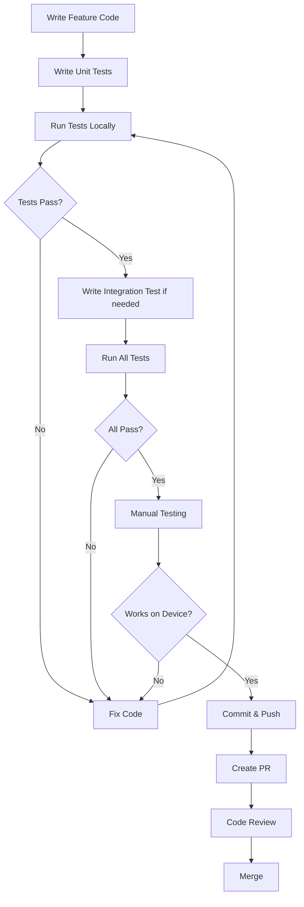

# Testing Strategy for Pigeon AI MVP

## Overview

This document outlines the testing strategy integrated into the MVP development workflow. Tests are embedded within specific PRs to verify code correctness as features are built.

---

## Testing Philosophy

**Goal**: Use automated tests to verify that code generated by AI coding agents is correct before merging PRs.

**Strategy**: 
- **Unit Tests**: Test individual functions and services in isolation
- **Integration Tests**: Test complete workflows across multiple components
- **Manual Tests**: Verify end-to-end functionality on real devices

---

## PRs with Testing Coverage

### ✅ PR #2: Authentication System

**Unit Tests**:
- `__tests__/services/authService.test.ts`
  - Sign up creates user in Firebase Auth
  - Sign up creates user profile in Firestore
  - Sign in returns user on valid credentials
  - Sign in throws error on invalid credentials
  - Sign out clears current user
  - Update profile updates user data

- `__tests__/utils/validators.test.ts`
  - Email validation (valid/invalid formats)
  - Password validation (minimum length)
  - Display name validation (non-empty)

**Integration Test**:
- `__tests__/integration/authFlow.test.ts`
  - Complete auth flow: signup → logout → login → navigate

**Why**: Authentication is the foundation - must be rock-solid.

---

### ✅ PR #3: Core Messaging Infrastructure - Data Layer

**Unit Tests**:
- `__tests__/services/firestoreService.test.ts`
  - Create conversation in Firestore
  - Send message with correct fields
  - Retrieve messages in correct order
  - Update message status
  - Mark message as read

- `__tests__/services/localDatabase.test.ts`
  - Insert message to SQLite
  - Retrieve messages by conversationId
  - Update existing message
  - Get all conversations

**Integration Test**:
- `__tests__/integration/messageFlow.test.ts`
  - Create conversation → send message → verify in both DBs
  - Update status → verify reflected in Firestore and local DB

**Why**: Data layer is critical - bugs here affect everything.

---

### ✅ PR #4: Chat UI & Real-Time Sync

**Unit Tests**:
- `__tests__/utils/dateFormatter.test.ts`
  - Format "Just now", "5m ago", "Yesterday", "Jan 15"
  - Verify smart timestamp formatting

**Integration Test**:
- `__tests__/integration/realtimeMessaging.test.ts`
  - User A sends → message saved to Firestore
  - User B listener receives update
  - Verify message appears within 2 seconds
  - Verify optimistic update (immediate for sender)

**Why**: Real-time sync is core feature - must work reliably.

---

### ✅ PR #5: Presence & Typing Indicators

**Unit Tests**:
- `__tests__/hooks/usePresence.test.ts`
  - Update presence on foreground (isOnline = true)
  - Update presence on background (isOnline = false)
  - Update lastSeen timestamp
  - Presence listener receives updates

- `__tests__/hooks/useTypingIndicator.test.ts`
  - Set typing status (true/false)
  - Typing status auto-clears after 3 seconds
  - Multiple users typing returns correct array

**Why**: Presence logic has timing edge cases that unit tests catch.

---

### ✅ PR #6: Read Receipts & Message States

**Unit Tests**:
- `__tests__/utils/messageHelpers.test.ts`
  - Calculate status: sending → sent → delivered → read
  - Group message status (read by 3/5)
  - Verify correct status for different scenarios

**Why**: Message status logic is complex with edge cases.

---

### ✅ PR #7: Image Sharing

**Unit Tests**:
- `__tests__/utils/imageCompression.test.ts`
  - Compress image to < 1MB
  - Maintain aspect ratio
  - Apply quality setting (0.7)
  - Handle invalid URIs

**Integration Test**:
- `__tests__/integration/imageUpload.test.ts`
  - Image picker → compression → upload → URL → save message
  - Verify complete image upload pipeline

**Why**: Image handling has many failure points - test each step.

---

### ✅ PR #8: Offline Support & Queue System (CRITICAL)

**Unit Tests**:
- `__tests__/store/offlineQueueManager.test.ts`
  - Enqueue operation
  - Persist queue to AsyncStorage
  - Process queue in order
  - Remove successful operations
  - Retry failed operations
  - Exponential backoff
  - Max retry limit (3)

- `__tests__/services/networkMonitor.test.ts`
  - Detect online/offline state
  - Fire callbacks on state change

**Integration Test**:
- `__tests__/integration/offlineFlow.test.ts`
  - Go offline → send message → queued
  - Go online → queue processes → message sent
  - Verify complete offline-to-online flow

**Why**: Offline support is MVP requirement - most complex logic - MUST be tested thoroughly.

---

### ✅ PR #9: Group Chat

**Integration Test**:
- `__tests__/integration/groupMessaging.test.ts`
  - Create group with 3 users
  - Send message → verify all members receive
  - Read message → verify readBy updated
  - Calculate group read status (2/3)

**Why**: Group messaging has multi-user complexity - integration test verifies delivery.

---

### ✅ PR #10: Push Notifications

**Unit Tests**:
- `__tests__/services/notificationService.test.ts`
  - Request permissions
  - Get device FCM token
  - Register token to Firestore
  - Handle notification data extraction

**Why**: Service functions can be tested; full notification flow requires manual testing.

---

### ❌ PR #1: Project Setup - No Tests

**Reason**: Configuration only, no logic to test.

---

### ❌ PR #11: UI Polish & Error Handling - No Tests

**Reason**: Mostly UI/UX improvements, difficult to automate. Manual testing sufficient.

---

### ❌ PR #12: Testing, Bug Fixes & Documentation - No Tests

**Reason**: This PR IS the testing phase (manual end-to-end testing).

---

## Test Execution Strategy

### When to Run Tests

1. **During Development**: Run tests for the component you're working on
2. **Before Committing**: Run all tests in the PR
3. **In CI/CD** (Nice-to-Have): Auto-run tests on PR creation
4. **Before Merging**: All tests must pass

### Commands

```bash
# Run all tests
npm test

# Run specific test file
npm test authService.test.ts

# Run tests in watch mode (during development)
npm test -- --watch

# Run tests with coverage
npm test -- --coverage

# Run only integration tests
npm test -- --testPathPattern=integration
```

---

## Test Dependencies

Add these to `package.json`:

```json
{
  "devDependencies": {
    "@testing-library/react-native": "^12.0.0",
    "@testing-library/jest-native": "^5.4.0",
    "jest": "^29.0.0",
    "jest-expo": "^50.0.0",
    "@types/jest": "^29.0.0"
  }
}
```

Configure Jest in `jest.config.js`:

```javascript
module.exports = {
  preset: 'jest-expo',
  transformIgnorePatterns: [
    'node_modules/(?!((jest-)?react-native|@react-native(-community)?)|expo(nent)?|@expo(nent)?/.*|@expo-google-fonts/.*|react-navigation|@react-navigation/.*|@unimodules/.*|unimodules|sentry-expo|native-base|react-native-svg)'
  ],
  setupFilesAfterEnv: ['@testing-library/jest-native/extend-expect'],
  collectCoverageFrom: [
    'src/**/*.{ts,tsx}',
    '!src/**/*.d.ts',
    '!src/**/*.test.{ts,tsx}',
  ],
};
```

---

## Mocking Strategy

### Firebase Mocking

```typescript
// __mocks__/@react-native-firebase/auth.ts
export default () => ({
  signInWithEmailAndPassword: jest.fn(),
  createUserWithEmailAndPassword: jest.fn(),
  signOut: jest.fn(),
  currentUser: { uid: 'test-user-id', email: 'test@example.com' },
});
```

### AsyncStorage Mocking

```typescript
// __mocks__/@react-native-async-storage/async-storage.ts
export default {
  setItem: jest.fn(),
  getItem: jest.fn(),
  removeItem: jest.fn(),
  clear: jest.fn(),
};
```

---

## Coverage Goals

### Minimum Coverage Targets

- **Unit Tests**: 80% coverage for services and utilities
- **Integration Tests**: Cover all critical user flows
- **Manual Tests**: 100% of MVP requirements verified

### High-Priority Coverage Areas

1. **Offline Queue Manager** (PR #8) - CRITICAL
2. **Authentication Service** (PR #2) - CRITICAL
3. **Firestore Service** (PR #3) - HIGH
4. **Message Status Logic** (PR #6) - HIGH
5. **Image Compression** (PR #7) - MEDIUM

---

## Success Criteria

**Before merging each PR with tests:**

1. ✅ All unit tests pass
2. ✅ All integration tests pass
3. ✅ Code coverage meets minimum targets
4. ✅ Manual testing scenarios pass
5. ✅ No console errors or warnings

**PR can be merged when:** All 5 criteria met.

---

## Testing Workflow



---

## Benefits of This Approach

1. **Early Bug Detection**: Catch issues before manual testing
2. **Refactoring Confidence**: Tests prevent regressions
3. **Documentation**: Tests serve as code examples
4. **AI Agent Verification**: Validate generated code automatically
5. **Faster Debugging**: Isolated tests pinpoint issues quickly

---

## Notes

- **Focus on Critical Logic**: Not all code needs tests (e.g., simple UI components)
- **Mock External Dependencies**: Firebase, AsyncStorage, Network calls
- **Keep Tests Fast**: Unit tests should run in milliseconds
- **Integration Tests Can Be Slower**: Acceptable for comprehensive checks
- **Manual Testing Still Required**: Automated tests don't replace device testing

---

## Summary: Test Count by PR

| PR | Unit Tests | Integration Tests | Total |
|----|------------|-------------------|-------|
| PR #2: Auth | 2 files | 1 file | 3 |
| PR #3: Data Layer | 2 files | 1 file | 3 |
| PR #4: Chat UI | 1 file | 1 file | 2 |
| PR #5: Presence | 2 files | 0 | 2 |
| PR #6: Read Receipts | 1 file | 0 | 1 |
| PR #7: Images | 1 file | 1 file | 2 |
| PR #8: Offline | 2 files | 1 file | 3 |
| PR #9: Groups | 0 | 1 file | 1 |
| PR #10: Notifications | 1 file | 0 | 1 |
| **TOTAL** | **12 test files** | **6 test files** | **18 test files** |

---

**With this testing strategy, you'll have confidence that AI-generated code works correctly before it reaches production!** 🧪✅

